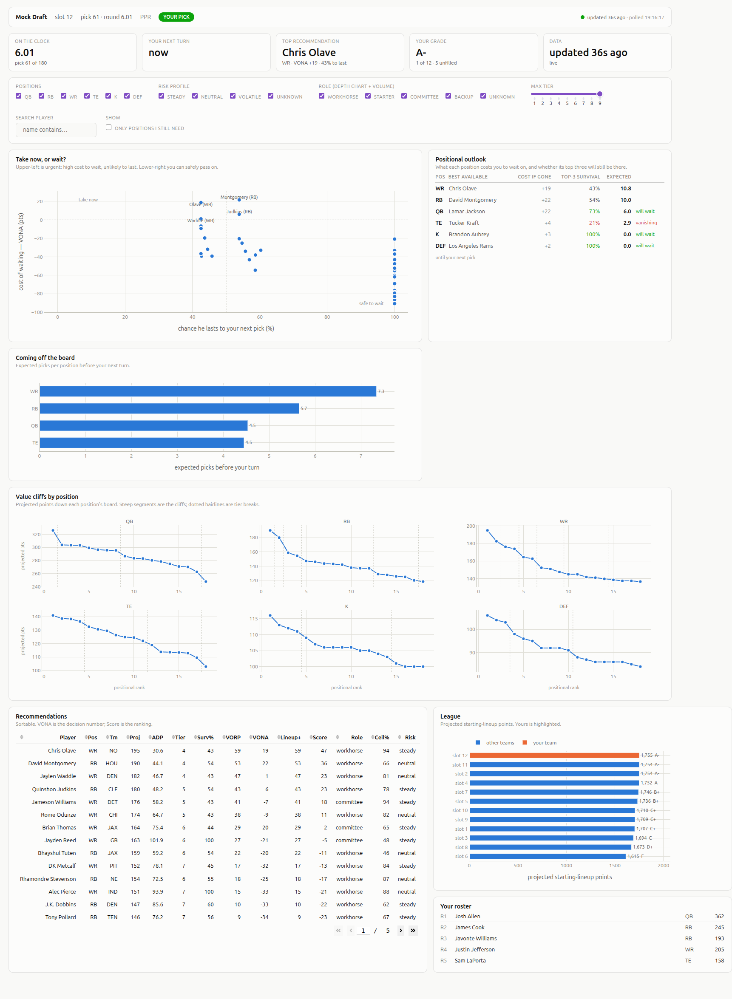
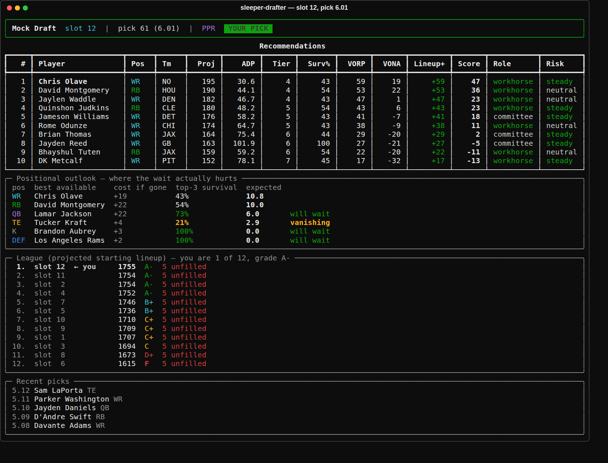
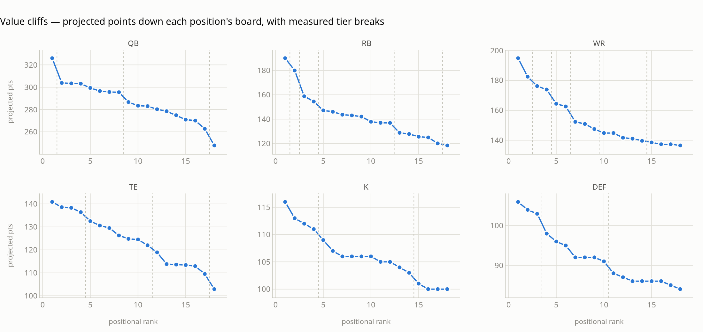
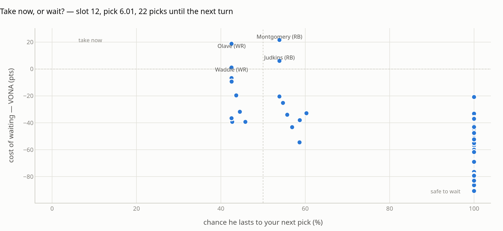
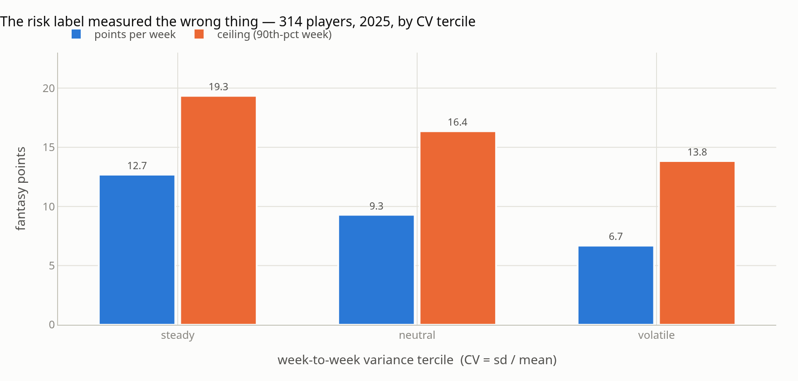
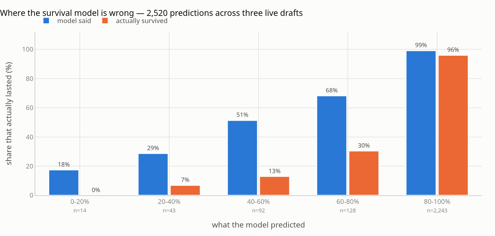
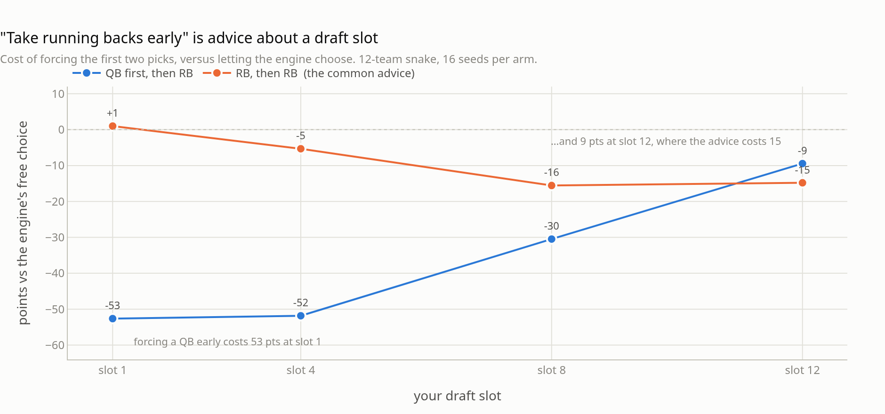

# I built a fantasy draft co-pilot, and the interesting part was everything it got wrong

*A read-only draft assistant for Sleeper, grounded in Isaac T. Petersen's* Fantasy Football Analytics. *Source: [github.com/godot107/sleeper-drafter](https://github.com/godot107/sleeper-drafter).*

---

Every fantasy football ranking answers the same question: **who is good?**

That is not the question you have on the clock. On the clock the question is
**who will still be here in twenty-two picks?** — and those are different
questions with different answers. The tight end you want will last two more
rounds. The running back ranked one slot below him will not. A list sorted by
projected points cannot tell you which is which, because the list does not know
who picks next or what they need.

So I built something that does. It watches a live Sleeper draft, models what
each opponent is likely to take before my turn comes around again, and ranks my
options by what it costs me to wait.



There is a terminal version too, which is the one I actually trust — one
process, no browser, no JavaScript between me and the numbers.



What I did not expect — and the reason this post exists — is how many of the
numbers that felt authoritative turned out to be measuring something other than
what I thought. The pattern repeated often enough to be the real subject here:
each one was caught not by thinking harder about the formula, but by checking it
against something outside the formula.

---

## The grounding: someone already did the theory

I did not want to invent a valuation model. Fantasy football analytics has a
serious, methodical, open-source treatment, and it is
**[Isaac T. Petersen's *Fantasy Football Analytics: Statistics for Fantasy
Football*](https://isaactpetersen.github.io/Fantasy-Football-Analytics-Textbook/)** —
a free online textbook covering projection, uncertainty, replacement level,
tiering and draft strategy with actual statistics rather than podcast intuition.
The book is the reason this project has opinions I can defend instead of
coefficients I made up.

Here is the honest chapter-by-chapter accounting of what I took:

| What | Where it comes from | How it's implemented here |
|---|---|---|
| **VORP** | Ch. 6 | Value over replacement, where replacement is *a typical **bench** player* — not the last starter. |
| **Dropoff** | Ch. 6, 7 | Points minus the next-best player at the same position. Measured, not thresholded. |
| **Tiers** | Ch. 21 | Cluster analysis on projected points. |
| **Uncertainty** | Ch. 6, Eq. 6.1 | CV = s/x̄. *This is the one that failed — see below.* |
| **K/DEF go late** | §7.4.1 | Kickers and defenses have the lowest measured dropoff, so waiting there is free. |
| **Don't join a run mid-stream** | Ch. 7 | Why the "deny your opponent" term is deliberately weak. |

Two implementation choices worth naming, because they are places where a
textbook idea meets a draft clock.

**Replacement level is a bench cohort, not a rank.** In a 12-team league with
two starting running backs, the naive replacement level is RB24. But RB24 is one
player having one projected season, and pinning a league-wide baseline to a
single row makes every VORP in the position wobble when that row moves. So
replacement is the *median of the twelve players immediately past the starter
cutoff* — the same idea, less sensitive to any one projection.

**Tiers use Fisher-Jenks natural breaks, not k-means.** This is a small decision
that matters enormously in practice. k-means has a random initialisation. Run it
twice on the same board and you can get two different tierings. That is fine in a
notebook and unacceptable when the board refreshes every two seconds while you
read it with forty seconds on the clock. Fisher-Jenks is an exact dynamic program
over 1-D data: same input, same tiers, every time. At ~215 wide receivers and
eight tiers it runs in well under a millisecond.



Read those panels and the whole draft strategy falls out. Quarterback has one
huge step at the very top and then a long gentle slope — which is why the one
elite quarterback is worth reaching for and the next ten are close enough that
reaching among them buys almost nothing.
Kicker is a straight line with no cliff anywhere, which is exactly Petersen's
§7.4.1 result and exactly why you take one in the last round.

---

## The core idea: VONA, not VORP

VORP is a static measure. It says *this player is worth 59 points more than a
typical bench body at his position*. True, and not decision-relevant, because if
I pass on him I do not get a bench body — I get **whoever is best at that
position when I pick again.**

That is the number I actually want:

> **VONA** (Value Over Next Available) = his points − the expected best player at
> his position at my next turn

If he scores 195 and the model expects the best available receiver at my next
pick to be worth 176, waiting costs me 19 points. That 19 is the entire
decision. Positive means take him now; negative means the position will keep.

To compute the second half you need a survival probability for every player — the
chance he lasts through every intervening pick.

### The normalisation that was missing

My original spec — which I wrote before I knew better — said:

> P(team *i* drafts *X* at pick *j*) ∝ Urgency × ADPWeight

and never resolved the ∝. That proportional sign is doing catastrophic work.
Unresolved, the "probabilities" are on an arbitrary scale, and every VONA
computed from them is a number with no units.

The fix is to notice the constraint that was there all along: **exactly one
player is taken at pick *j***. So the scores normalise over the available pool:

```
score(X, j)     = Urgency(team_at_j, pos(X)) · ADPWeight(X, j)
P(X taken at j) = score(X, j) / Σ_{X' available} score(X', j)
P_survives(X)   = Π_j (1 − P(X taken at j))
```

A pleasant corollary: the `1/√(2πσ²)` in front of the Gaussian ADP kernel is
constant across players and cancels in the normalisation, so it can be dropped.

### The subtraction that is easy to get wrong

Expected-best-available must **exclude the candidate himself.** If I draft
Chris Olave, Chris Olave is precisely the player who will not be available at my
next pick. Leaving him in the expectation makes every top player look like "the
same guy you'd get later," which quietly collapses VONA to zero exactly where it
matters most.

Doing that naively is O(n²) — rebuild the expectation once per candidate. It is
actually linear, with a forward and a backward pass:

```
F[i] = s[i]·p[i] + (1−s[i])·F[i+1]     F[n] = replacement level
G[i] = Π_{l<i} (1−s[l])                 every better player is gone
H[i] = Σ_{l<i} s[l]·p[l]·G[l]           value if one of them survives

E[best available, excluding i] = H[i] + G[i]·F[i+1]
```

That `F[n] = replacement` tail is the second thing the spec got wrong: it summed
over the ranked pool and left probability mass unaccounted for in the case where
*nobody* survives. Somebody is on your roster in that case, and he is worth
replacement level, not zero.

Plot survival against VONA and the decision becomes a picture:



Upper-left is "take him now": expensive to wait, unlikely to last. Lower-right is
just as useful — those are the players you can safely pass on this turn, and
knowing that is what lets you spend the pick somewhere else. The vertical stripe
at 100% is everyone the model is confident nobody wants yet.

---

## Now the part where I was wrong

### 1. The textbook's uncertainty metric measured the wrong thing

Petersen defines uncertainty as the **spread of a player's projections across
sources** (Ch. 6, Eq. 6.1). Sensible: if four projection systems disagree wildly
about a player, that is real uncertainty about him.

I had one source. So I substituted **week-to-week scoring variance from last
season** — same coefficient of variation, s/x̄, different input. It felt like a
reasonable stand-in. I shipped it as a "risk profile" column: steady / neutral /
volatile.

Then I tested it, and it is not a stand-in at all:



The "volatile" third of the league has a **lower** 90th-percentile week than the
"steady" third. Correlation between CV and points per week is **−0.58**, and
between CV and ceiling **−0.40**. The label was pointing at the opposite of what
a risk label is supposed to mean.

The reason is embarrassingly simple once you see it: **CV has the mean in the
denominator.** A player averaging 3 points a week with a 3-point standard
deviation has CV 1.0 and looks wildly volatile. He is not volatile; he is bad. CV
finds low-volume players whose small scores bounce around zero, not the
boom-or-bust starters the draft advice is about.

The substitution was invalid — cross-source spread and within-season variance are
not the same quantity, and only one of them is about the projection. So I kept CV
as a label for what it actually measures, and added two metrics that answer the
questions I had been asking it:

- **`role`** — depth-chart position plus projected volume, ranked within
  position.
- **`ceiling`** — the player's 90th-percentile week last season. The honest
  late-round upside measure.

On the 312 players with ten or more games last season, correlation with projected
points: **CV −0.50, role +0.80, ceiling +0.80.** The sign on the one I inherited
from the formula is the wrong one.

The failure is not Petersen's. His metric measures what he says it measures. It
is a lesson about substituting a proxy into a formula and inheriting its
authority without inheriting its meaning.

### 2. The survival model is confidently wrong in the middle

`--replay` re-runs a finished draft pick by pick and scores every survival
prediction against what actually happened. Pooled across three live drafts —
2,520 predictions:



The 80–100% bucket is nearly perfect: 99% predicted, 96% actual. That bucket is
also 89% of all predictions, which is why the headline Brier score (**0.052–0.070**
per draft) looks respectable and the overall bias is only **+6.6 points
optimistic** (94.2% predicted against 87.6% actual).

The middle is a disaster. Players the model called 40–60% survived **13%** of the
time. Players it called 60–80% survived **30%**.

And the direction is exactly what the model's own assumption predicts. Survival
multiplies per-pick probabilities **as if the picks were independent**. Real
drafts have *runs* — three receivers in four picks, because managers watch each
other. Independence is least damaging at the extremes (nobody wants him; everybody
does) and most damaging in the contested middle, which is precisely where the
chart falls apart.

I have not fitted a correction, and the reason is instructive. The obvious one is
a single exponent — replace *p* with *p^γ*. Solving for the γ that matches the
overall mean gives **γ ≈ 4**, and applying it lands the middle buckets on the
*other* side of the truth: the 60–80% bucket goes from 68% predicted to 22%
against an actual 30%, and 40–60% goes from 51% to 7% against an actual 13%. One
knob cannot fix a bias whose size depends on where you are in the range, and
three drafts is roughly forty-five independent turns — nowhere near enough to fit
something shaped better than that.

So the bias is documented instead. `--replay` appends to a calibration log after
every draft, and the correction waits for evidence. Publishing the
miscalibration is more useful than papering over it: a number you know is seven
points optimistic is usable, and one you believe is not.

### 3. A scoring bug that only a real draft could find

Offline mock drafts sample opponents from **the very distribution the opponent
model assumes**. They validate the arithmetic beautifully and can never
disconfirm the model. Almost every real bug surfaced in a live Sleeper mock.

The worst one: my roster had one FLEX slot, shared between running backs,
receivers and tight ends. The code asked each position *independently* whether it
had flex capacity, so with one flex slot open, RB **and** WR **and** TE each
believed the slot was theirs. Tight ends won that argument, because tight end has
the steepest cliff, and I finished drafts with 3.5 tight ends for one starting
spot.

Then a second bug in the same neighbourhood: an empty *dedicated* slot was
credited at replacement level, but an empty *flex* slot was credited at **zero**.
Filling a flex hole therefore appeared to be worth a player's entire projection.
Sam LaPorta scored **+158.5**. After the fix: **+9.3**. A 158-point tight end had
been outranking a 190-point running back.

Neither was a maths error. Both were a modelling error about what a roster slot
*is*, and both are now pinned by tests.

### 4. The board that was four minutes old

Mid-draft, live, the model recommended a player who had been drafted forty picks
earlier. Sleeper's picks endpoint sits behind a CDN with `s-maxage=300`, and the
response carried `Age: 261` — I was reading a board frozen at pick 3 while the
draft was at pick 43. **I made a recommendation off that board and did not catch
it.**

The fix is one line — a cache-busting query parameter — and the lesson is the
expensive part: a dashboard that has quietly stopped updating is *worse* than no
dashboard, because it looks exactly like a working one. The UI now states when
data last changed and goes amber, then red, as that ages.

---

## The peer-advice experiment

My league-mates all say the same thing: **spend the first two picks on running
backs and receivers, never on a quarterback.** Conventional, widely held, and
testable — because "where the value is" depends on *where you pick*.

So I forced the first two picks to a given position pair, let the engine draft
normally afterwards, and scored the final starting lineup. Same board, same seeds,
same simulated opponents; the constraint is the only thing that varies.



| Forced first two picks | slot 1 | slot 4 | slot 8 | slot 12 |
|---|---:|---:|---:|---:|
| **RB, RB** — the advice | **+1** | −5 | −16 | **−15** |
| RB, WR | −9 | −14 | −11 | −8 |
| **QB, RB** — the heresy | **−53** | −52 | −30 | **−9** |
| WR, WR | −54 | −37 | −36 | −32 |
| QB, WR | −60 | −55 | −35 | −18 |

*Points of projected starting lineup versus the engine's own unconstrained choice. 12-team snake, 15 rounds, 16 seeds per arm, 384 simulated drafts.*

**The advice is correct, and it is correct about a seat I do not sit in.**

At **slot 1** it is emphatically right. Forcing RB-then-RB costs nothing at all
(+1, i.e. it *is* what the engine wanted), and forcing a quarterback first costs
**53 points**. Left alone, the engine opens with a running back in 27 of its 32
early picks there.

By **slot 12** the ordering has inverted. Forcing RB-then-RB now costs **15
points**; forcing the quarterback costs **9**. And unconstrained, the engine
opens with a quarterback more often than anything else — 14 of its 32 first-two
picks at that slot, against 9 running backs.

The mechanism is visible on the value-cliff chart earlier in this post. Six
running backs carry an ADP inside the first twelve picks, so by slot 12 what
remains at the position is a flat block — the next five backs span nineteen
points, and it barely matters which one you get. Meanwhile a 12-team league needs
only twelve quarterbacks, so the one genuine outlier at the position is still
sitting there, 35 points clear of the next one.

The advice is not wrong. It is a statement about **where value sits when you pick
early**, and it is being repeated in a seat where it no longer applies. That is
worth more to me than the six points: it is a reason, and a reason survives a
change in the player pool in a way that a rule of thumb does not.

Caveat, stated plainly: this is one projection source and one season's shape. It
should be re-run every year, which is why it ships as a script rather than a
conclusion.

---

## It does not draft for you, on purpose

Sleeper's public API is **read-only**. There are no documented endpoints for
submitting a pick, making a trade, or modifying a roster. You could get around
that with session scraping or a headless browser driving the web UI. This project
deliberately does not, and the constraint is written into its `CLAUDE.md` so it
stays that way.

Three reasons, in order of how much they matter:

1. **Terms of service.** Automating writes against a platform that does not offer
   a write API is asking to have the account removed.
2. **Brittleness.** A scraped session breaks at the worst possible moment, which
   is during the ninety seconds you have to make a pick.
3. **The model does not know things.** Breaking injury news lands on Twitter
   fifteen minutes before it lands anywhere structured. Human veto is not a
   limitation of the design; it is the most valuable input in the system.

So it ranks, and I click. Dashboard on one monitor, terminal on the second,
Sleeper on the third.

---

## Did it work?

Four live mock drafts, in order:

| Draft | League | Finish | Grade | RB points vs league mean |
|---|---|---|---|---|
| 1 | 10-team | 1st | A+ | — |
| 2 | 12-team | 6th | B− | −151 |
| 3 | 12-team | 4th | B− | −129 |
| 4 | 12-team, slot 12 | **3rd** | **A** | **−23** |

The improvement between draft 3 and draft 4 was not a smarter algorithm. It was
the flex fix, which stopped the engine from spending premium picks on a second
elite tight end and let it take a running back at the turn instead.

Grades are computed the same way for every team in the league: fill the best
legal starting lineup from each roster, total the projected points, and rank. It
is the same lineup solver the recommendation engine uses, which means the grade
and the advice cannot disagree with each other.

---

## What I would tell someone building this

**Ground it in something.** The textbook is why the model has defensible
positions instead of tuned constants. Where I departed from it — a bench cohort
instead of a single replacement rank, Fisher-Jenks instead of k-means — I can say
why, and the reason is about the draft clock rather than about taste.

**A proxy does not inherit a formula's authority.** CV in Petersen's sense and CV
over weekly scores are the same three symbols measuring different things. The
formula did not warn me. The data did.

**Simulate to test arithmetic; go live to test the model.** Mock drafts sample
opponents from the model's own assumptions. They cannot disconfirm it. Every
genuinely interesting bug came from a real draft with real humans.

**Publish the miscalibration.** The survival chart is the least flattering thing
in this repo and the most useful thing in it. Documenting where a model is wrong
is not an admission that it is broken; it is the difference between a number you
can reason with and a number you can only believe.

**Look at the chart.** Two visual bugs — a sort order that silently did nothing
and a label that ran off the frame — survived every test I had and died the
moment I rendered the image and looked at it.

---

## Credits and links

- **[Isaac T. Petersen, *Fantasy Football Analytics: Statistics for Fantasy Football*](https://isaactpetersen.github.io/Fantasy-Football-Analytics-Textbook/)** — the methodological backbone: replacement level, dropoff, tiering, uncertainty, and the positional strategy that follows from them. Free, rigorous, and the best thing written on this subject. If you take one link from this post, take that one.
- **[Sleeper API docs](https://docs.sleeper.com/)** — public, unauthenticated, read-only, and generous. No API key required to run any of this.
- Built in Python with `pandas`, `numpy`, `rich` (terminal), and `dash` + `plotly` (browser).
- Source, tests and runbook: **[github.com/godot107/sleeper-drafter](https://github.com/godot107/sleeper-drafter)**

Everything in this post reproduces from the repo:

```bash
python scripts/fetch_projections.py         # real projections + ADP
python scripts/fetch_consistency.py         # weekly variance from last season

python scripts/experiment_cv.py             # the CV failure
python scripts/experiment_first_two.py      # the first-two-picks experiment
python main.py --replay <draft_id>          # survival calibration on a finished draft

python main.py --web --mock --slot 12       # the dashboard, on a simulated draft
pytest -q                                   # 146 tests
```
